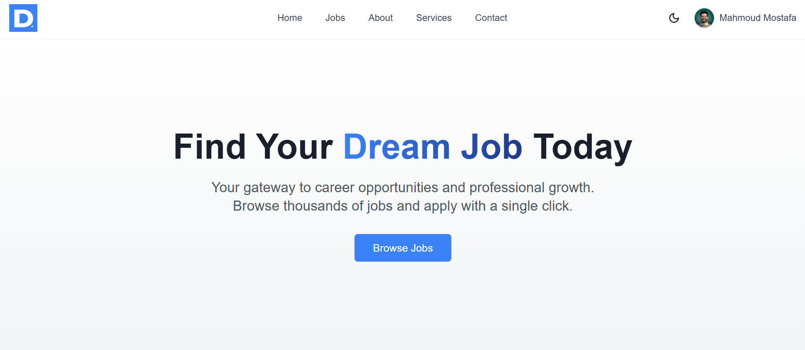
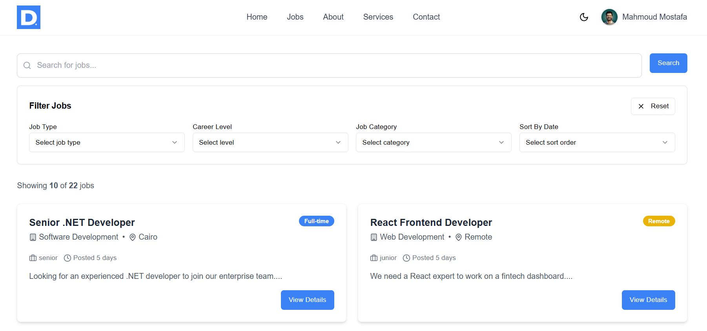
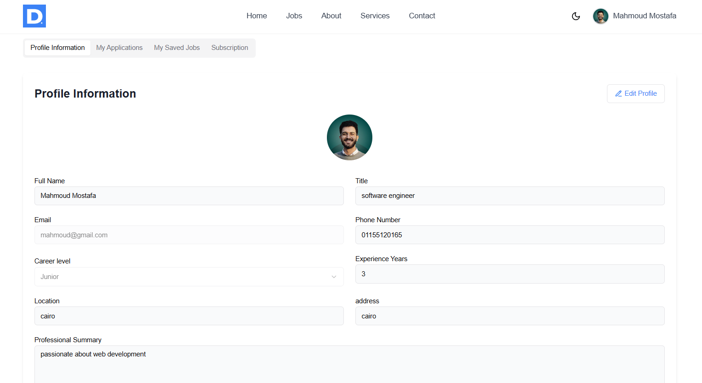

# 💼 Dawam - Smart Job Portal

Dawam is a full-stack job portal platform tailored for both job seekers and job posters, with a powerful admin dashboard and integrated premium features. Developed as a graduation project for DEPI.

## 🚀 Features

### 👤 Job Seeker
- Apply to jobs
- Save jobs for later
- Track submitted applications
- Premium users get analytics:
  - Total applicants
  - Average experience
  - Average expected salary

### 🏢 Job Poster
- Post and manage job listings (open/close)
- View CVs and applicant profiles

### 🛠️ Platform
- 🔍 Advanced filtering and pagination
- 🌙 Dark mode
- 🔐 Secure authentication with .NET Identity & JWT
- 🔁 Password reset functionality
- 💼 Premium subscription using Stripe
- ⚡ Optimized data fetching using Axios & React Query
- 🧪 API testing with Swagger
- 📧 Email testing via Mailtrap

### 👨‍💼 Admin Dashboard
- Platform-wide analytics (users, job posts, applications, etc.)
- Ban/unban users
- Remove job posts

## 🧰 Tech Stack

### Frontend
- React.js
- TypeScript
- Axios
- React Query
- Tailwind CSS

### Backend
- .NET Core Web API
- Entity Framework Core
- .NET Identity
- JWT Authentication
- Swagger
- Mailtrap

### Database
- SQL Server

### Payments
- Stripe (Subscription-based model)

### Authentication
- Role-based:
  - Admin
  - Job Poster
  - Job Seeker

## 📸 Screenshots

> *(Add screenshots here if available)*

## 🔗 Live Demo

👉 [https://dawamdepi.netlify.app/](https://dawamdepi.netlify.app/)

## 👥 Team

- 👨‍💻 Mahmoud 
- 👨‍💻 Khaled

## 👨‍🏫 Instructor

- Karim – for the valuable guidance and support throughout the project

## 📜 License

This project is licensed under the MIT License - see the [LICENSE](LICENSE) file for details.

---

> 💬 Feel free to fork this project, open issues, and submit pull requests!

---

## 📌 Tags

`#GraduationProject` `#Dawam` `#ReactJS` `#TypeScript` `#Axios` `#ReactQuery` `#DotNetCore` `#DotNetIdentity` `#JWT` `#Stripe` `#Swagger` `#Mailtrap` `#SQLServer` `#FullStackDeveloper` `#DEPI` `#ProjectShowcase`
